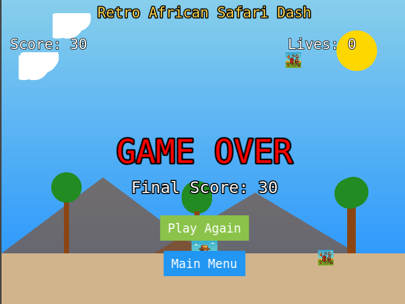
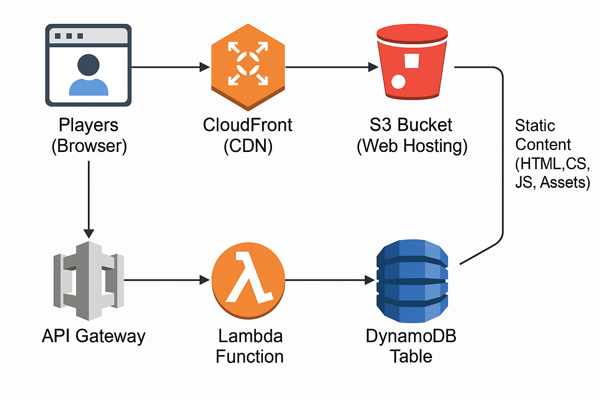

# Retro African Safari Dash 🦒🌍

A retro-style, 8-bit arcade game where players control a character navigating an African savanna, collecting cultural artifacts while avoiding obstacles. Built for the AWS Amazon Q Developer Challenge "That's Entertainment!" 🎮✨.


## Play the Game 🎉

The game is available at: [https://d33ejg1jsmvn6g.cloudfront.net](https://d33ejg1jsmvn6g.cloudfront.net) 🌐

## Project Overview 📝

This project demonstrates how Amazon Q Developer can be used to create an entertaining retro-style game with AWS infrastructure. The game features:

• 8-bit pixel art aesthetic inspired by 90s arcade games 🎨
• Player movement with arrow keys 🕹️
• Collectible artifacts that increase score 🏺
• Obstacles to avoid 🚧
• Lives system with progressive difficulty ❤️
• Leaderboard system using DynamoDB 🏆
• Serverless backend with AWS Lambda and API Gateway ⚙️

## Architecture 🏗️

The project uses the following AWS services:

• **S3**: Hosts the static game files (HTML, CSS, JavaScript, assets) 📦
• **CloudFront**: Provides CDN for fast content delivery 🌍
• **DynamoDB**: Stores leaderboard data 📊
• **Lambda**: Processes score submissions and retrieves leaderboard data ⚡
• **API Gateway**: Provides RESTful API endpoints for the game 🔗



## How Amazon Q Developer Was Used 🤖

Amazon Q Developer was instrumental in creating this project:

1. Infrastructure as Code: Generated and modified Pulumi code to provision AWS resources 🛠️
2. Game Logic: Created the core game mechanics using Phaser.js 🎲
3. Backend Development: Developed Lambda functions for leaderboard functionality 💻
4. Frontend Integration: Connected the game to the backend services 🌐
5. Documentation: Generated comprehensive documentation 📚

## Game Features 🎮

• **Retro Aesthetic**: Pixel art graphics and simple gameplay mechanics 🖌️
• **Progressive Difficulty**: Game speed increases over time ⏩
• **Score System**: Collect artifacts for points, avoid obstacles to keep lives 🥇
• **Leaderboard**: Submit your score and see how you rank against other players 📈
• **Authentication**: Admin and user login options for score submission 🔐

## Testing Credentials 🔑

As required by the challenge, you can use these credentials for testing:

• Admin:
  • username: admin 👑
  • password: 2025DEVChallenge 🛡️
• User:
  • username: newuser 🧑
  • password: 2025DEVChallenge 🛡️

## Local Development 💻

### Prerequisites ✅

• Node.js 14+ 🟢
• Python 3.6+ 🐍
• Pulumi CLI 🛠️
• AWS CLI configured with appropriate credentials 🔧

### Setup 🛠️

1. Clone the repository:
  

   ```bash
   git clone https://github.com/vec21/retro-african-safari-dash.git
   cd retro-african-safari-dash
   ```

2. Install dependencies:
  

   ```bash
   cd lambda
   npm install
   cd ..
   python -m venv venv
   source venv/bin/activate
   pip install pulumi pulumi_aws pulumi_random
   ```

3. Deploy with Pulumi:
  
   ```bash
   ./deploy.sh
   ```

4. For local testing:
  
   ```bash
   cd www
   python -m http.server 8000
   ```
   
  Then visit http://localhost:8000 in your browser 🌐.

## Game Controls 🎮

• **Arrow Keys**: Move the player character ⬆️⬇️⬅️➡️
• **ESC**: Pause game ⏸️
• **Space/Enter**: Start game / Submit score ▶️✅

## Deployment 🚀

The project includes a deployment script (deploy.sh) that:

1. Creates necessary AWS resources using Pulumi 🛠️
2. Uploads game files to S3 📤
3. Configures CloudFront for content delivery 🌍
4. Sets up DynamoDB, Lambda, and API Gateway for the backend ⚙️
5. Updates the API URL in the game configuration 🔗

## Future Enhancements 🔮

• Add more variety of artifacts and obstacles 🏺🚧
• Implement additional levels with different themes 🌄
• Add power-ups and special abilities ⚡
• Enhance the visual effects and animations ✨
• Implement user profiles for persistent player data 👤

## License 📜

MIT

## Acknowledgements 🙌

• Created with Amazon Q Developer for the AWS Challenge 🤖
• Built using Phaser.js game framework 🎮
• Infrastructure managed with Pulumi 🏗️